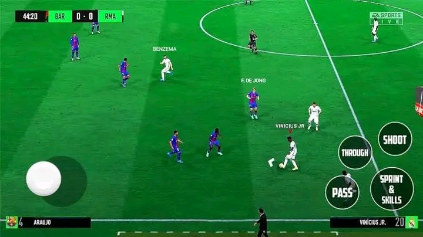

<!DOCTYPE html>
<html lang="en">
<head>
<meta charset="UTF-8">
<meta name="viewport" content="width=device-width, initial-scale=1.0">
<title>lks saske.com </title>
<link rel="stylesheet" href="styles.css">
</head>
<body>

<header>
  <head>
    <h3  LKS SASKE 🔱</h3>

<body>

    <form>
        <input type="text" placeholder="Search...">
        <button type="submit">Search</button>
    </form>

  

  <nav> <h6> By LKS SASKE 🔱 </h6>
   
Check out my social media profiles:

    <ul>
        <li><a style="color:red;" href="https://youtube.com/@lks_saske.?si=UcuZfV2FPUeSvwaa">YouTube</a></li>
        <li><a style="color:blue;" href="https://www.facebook.com/profile.php?id=100092680726769">Facebook</a></li>
      <li><a style="color:green;" href="https://instagram.com/lks_saske?igshid=OGQ5ZDc2ODk2ZA==">Instagram</a></li>
      
    </ul>
    <head>
<meta charset="UTF-8">
<meta name="viewport" content="width=device-width, initial-scale=1.0">
<title>Dropdown Menu</title>

</head>
<body>

  <button>MENU</button>
  

    <a style="background-color:Tomato;" href="index.html">Home</a>
    <a style="background-color:Tomato;" href="About.html">About</a>
    <a style="background-color:Tomato;" href="https://youtube.com/@lks_saske.?si=UcuZfV2FPUeSvwaa">Youtube</a>
    <a style="background-color:Tomato;"href="https://www.facebook.com/profile.php?id=100092680726769">Contact us </a>
  

  </nav>
</header>

<section class="hero">
  <h2 style="background-color:Tomato;">GET THE BEST GAMING AND TECH UPDATES AND GUIDES</h2> 
  <h3>TOP GAMES AND GUIDES</h3>
    
  <a style="color:red;" href="winning eleven 2024.html">WINNING ELEVEN 2012 MOD 2024</a> 
   
 
 

   
  <a style="color:red;" href="FIFA 16 MOD 24 .html">FIFA 16 MOD EA SPORTS FC 24</a>  
</section>

<main>
  <article>
    <h2 style="background-color:Tomato;">EXPLORE MORE GAMES</h2>
    <a style="color:red;" href="fcm 24 tactics.html">FCM 24 FULL TACTICS | FOOTBAL CLUB MANAGMENT 2024 TACTICS</a>
    
    <a style="color:red;"href="geometric dash lite.html">GEOMETRIC DASH LITE| THE EXCLUSIVE GUIDE AND GAMEPLAY</a> 
   
      <a style="color:red;" href="ppsspp for beginners .html">Mastering PPSSPP: How to Play Your Favorite PSP Games on Your Phone or PC! </a> 
     
    <a style="color:red;" href="winning eleven 2024.html">WINNING ELEVEN 2012 MOD 2024/PES 2012 MOD 2024 - BY LKS SASKE</a>
    
    <a style="color:red;" href="FIFA 16 MOD 24 .html">FIFA 16 PPSSPP MOD EA SPORTS FC 24 ANDROID OFFLINE BEST GRAPHICS PS5 ALL NEW FACES  & LAST TRANSFER</a>
    
     
    <h2 style="background-color:Tomato;">TECH UPDATE AND SOFTWARE TUTORIALS</h2>
<a style="color:red;" href="display feature .html">SOLUTION FOR DISPLAY OVER OTHER APPS FEATURE NOT AVAILABLE</a>
    
    <a style="color:red;" href="ppsspp settings .html">PPSSPP SETTINGS - HOW TO DO SETTINGS FOR PPSSPP</a>
    
    <h2 style="background-color:Tomato;">NEWS AND UPDATES </h2>
    <h1>Comment Section</h1>

<form id="comment-form">
  <label for="name">Name:</label>
  <input type="text" id="name" name="name" required>  
  
  <label for="comment">Comment:</label> 
  <textarea id="comment" name="comment" rows="4" cols="50" required></textarea>  
  
  <button type="submit">Submit Comment</button>
</form>

  <!-- Comments will be displayed here -->

   
  <!DOCTYPE html>
<html>
<head>
  
</head>
<body>
  
<footer>
  <head>
  <meta charset="UTF-8">
  <meta http-equiv="X-UA-Compatible" content="IE=edge">
  <title>Privacy Policy, Disclaimer, and About</title>
  
</head>
<body>
  

    <a style="color:white;" href="PRIVACY POLICY .html">PRIVACY POLICY</a>
    <a style="color:white;"href="DISCLAIMER .html">DISCLAIMER</a>
    <a style="color:white;"href="About.html">ABOUT</a>
  

  
&copy; 2024 LKS SASKE. All rights reserved.

</footer>

</body>
</html>

